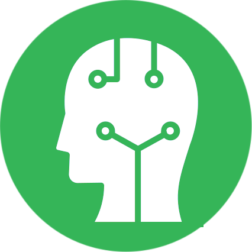

#  AI Assist DM

**AI Assist DM** is a Chrome extension designed to integrate ChatGPT with oplaTool. Its primary goal is to assist decision-makers (DMs) in selecting the most appropriate objective function for optimizing the PLA to meet their specific goals.

## How to Use

1. **Pre-setup:** Open ChatGPT in a new tab and start a new chat (signing in is optional).
2. **Connect:** Click the **Connect** button to establish a connection with the WebSocket.
3. **Wait:** Allow a moment for the connection to be successfully established.
4. **Ready:** Once connected, the extension is ready to receive and send messages.
5. **Disconnect:** To disconnect, simply click the **Disconnect** button.
6. **Test:** To verify the extension is functioning correctly, click the **Send test message** button. This test operates independently of the connection status.

## Communicating via WebSocket

Messages intended for the extension should be in the following format:

```json
{
    "from": "CLIENT",
    "content": "This is an example prompt for ChatGPT."
}
```

If the attribute `from` isn't present or its value is not "CLIENT", the message will be ignored. Otherwise, the extension will send the prompt to ChatGPT and wait for the response to be fully generated. The answer will be sent back to the WebSocket in the following format:

```json
{
    "from": "CHAT_GPT",
    "content": "This is an example of an answer."
}
```

## Installation

[**Download Chrome Extension**]()

## For Developers

For instructions on contributing and working with this project, please refer to the `quickstart.md` file.

---

This project was bootstrapped with [Chrome Extension CLI](https://github.com/dutiyesh/chrome-extension-cli).
